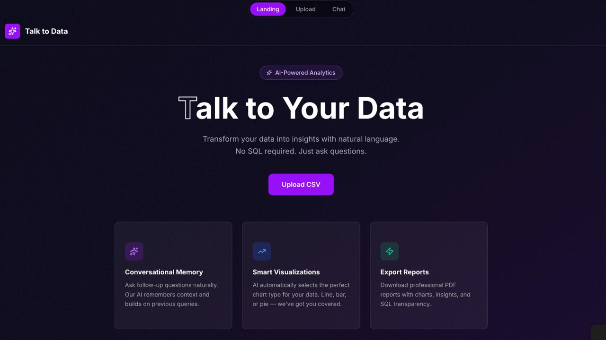
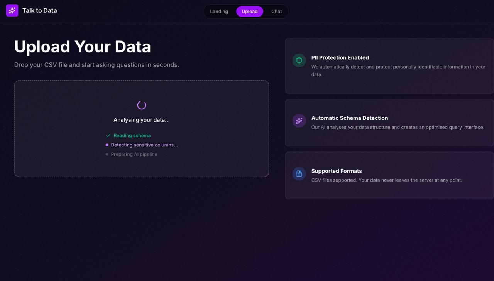
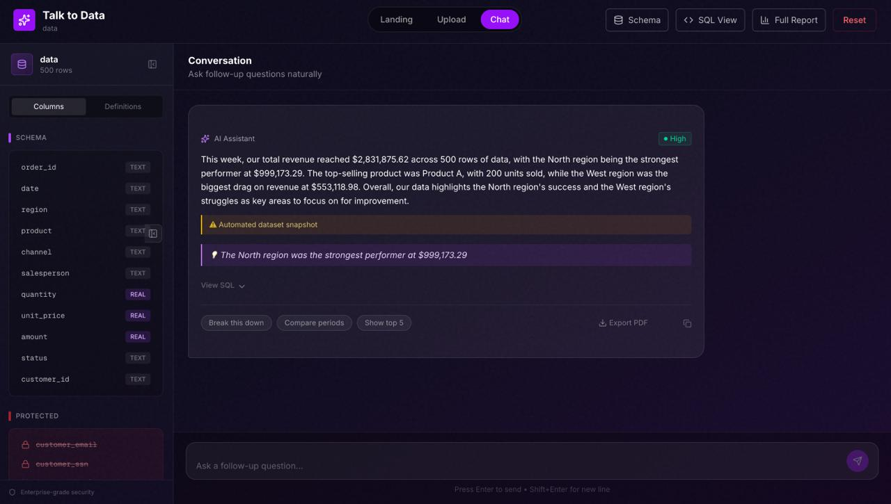
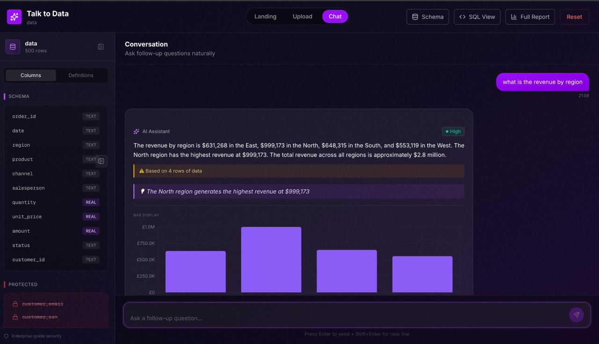
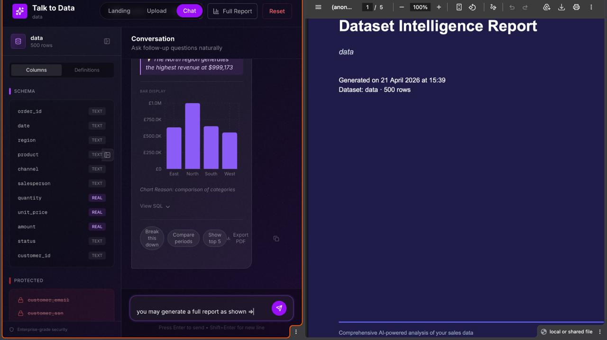
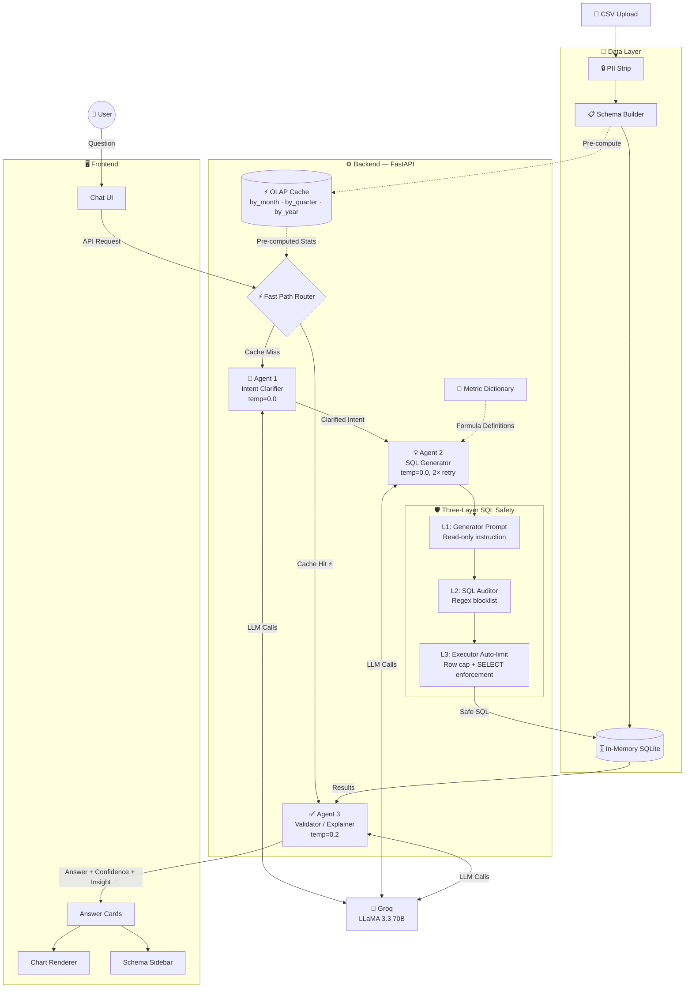
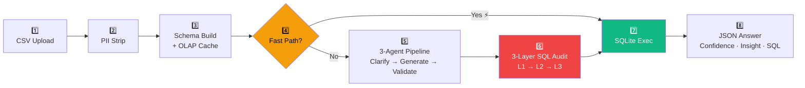

<div align="center">

#  Talk to Data

**Ask questions about your data in plain English. Get instant, verified answers.**

<br/>

[](https://python.org)
[](https://react.dev)
[](https://fastapi.tiangolo.com)
[](https://groq.com)
[](https://sqlite.org)

<br/>

[🚀 Quick Start](#-quick-start) • [✨ Features](#-features) • [🎨 See It In Action](#-see-it-in-action) • [🏗️ Architecture](#️-architecture) • [🔌 API Reference](#-api-reference) • [⚠️ Limitations](#️-limitations)

</div>

---

<div align="center">

&nbsp;&nbsp;&nbsp;[](https://talk-to-data-backup.vercel.app/)&nbsp;&nbsp;&nbsp;[](https://github.com/shabdagya/talk-to-data)

</div>

---

## 👥 Team

> **Gradient Descenters** — NatWest Hackathon 2026

| Role | Member |
|------|--------|
| 🧑‍💻 Team Leader | [@Shriya](https://github.com/shrrrriya) |
| 🧑‍💻 Member | [@Shabdagya](https://github.com/shabdagya) |
| 🧑‍💻 Member | [@Dhruv](https://github.com/Dhruv-Tuteja) |
| 🧑‍💻 Member | [@Dhanu](https://github.com/dhanubansal777) |

---

## ✨ Features

**Querying**
- 🗣️ &nbsp;**Natural Language Querying** — Ask *"What was revenue by region in Q3?"* and get a data-backed answer. No SQL needed.
- 🧠 &nbsp;**Conversational Memory** — Remembers the last 6 turns, so follow-ups like *"Now filter that to Q4"* just work.
- ⚡ &nbsp;**Temporal Date Awareness** — Auto-detects your dataset's date range and injects it into context to prevent hallucinated time references.
- ✨ &nbsp;**One-Click Executive Summary** — Four batch queries, one 3-sentence business brief. No prompting required.

**AI Pipeline**
- 🤖 &nbsp;**3-Agent Pipeline** — Intent Clarifier → SQL Generator → Validator & Explainer. Each agent does one thing well.
- ⚡ &nbsp;**Fast Path Router** — Intercepts questions matching pre-computed OLAP stats (`by_month`, `by_quarter`, `by_year`) and skips all three agents entirely for sub-millisecond temporal responses.
- 📖 &nbsp;**Metric Dictionary** — Business terms like "revenue" and "AOV" are locked to exact SQL formulas — always consistent, never drifting.
- 🔍 &nbsp;**Schema Extraction** — Agents only ever see column names, types, and sample values. Never your raw rows.

**Privacy & Safety**
- 🔒 &nbsp;**PII Auto-Removal** — SSNs, emails, and phone numbers are stripped before data touches the database.
- 🛡️ &nbsp;**Three-Layer SQL Safety** — Independent L1 (generator prompt), L2 (regex auditor), and L3 (executor enforcement) checks. `DROP`, `DELETE`, `UPDATE`, `INSERT` are blocked at every layer.

**Results & Export**
- 💬 &nbsp;**Answer Cards** — Every answer comes with a confidence badge, key insight, and a collapsible SQL view.
- 📊 &nbsp;**Auto Chart Selection** — Line for trends, bar for comparisons, pie for proportions. AI picks, you read.
- 📄 &nbsp;**Per-Answer PDF** — Export any single answer as a clean 4-page report instantly.
- 📑 &nbsp;**Full Dataset Report** — One-click 5-page executive PDF with 6 KPIs, regional breakdowns, and an AI-written summary.

---

## 🎨 See It In Action

<div align="center">


<br/><sub><b>🏠 Landing Page — AI-Powered Analytics at a glance</b></sub>

<br/><br/>


<br/><sub><b>📂 CSV Upload with automatic PII Detection & Schema Analysis</b></sub>

<br/><br/>


<br/><sub><b>💬 Chat Interface — Executive Summary with confidence badge & SQL transparency</b></sub>

<br/><br/>


<br/><sub><b>📊 Automatic Chart Selection — Revenue by region rendered as a bar chart</b></sub>

<br/><br/>


<br/><sub><b>📑 Full Dataset Intelligence Report — one-click PDF export</b></sub>

</div>

---

## 🏗️ Architecture

The system uses a **multi-layered agentic pipeline** with a pre-computed temporal caching layer, three independent SQL safety layers, and robust privacy controls.

---

### System Overview



---

### 8-Step Data Flow



---

### Component Reference

#### 1️⃣ Data Ingestion & Security

| Component | File | Responsibility |
|-----------|------|----------------|
| 🔒 Privacy Filter | `core/privacy_filter.py` | Automatically detects and strips PII (SSNs, emails, names) before data is stored |
| 🗄️ DB Loader | `core/db_loader.py` | Manages in-memory SQLite lifecycle and session state |
| ⚡ Temporal OLAP Cache | `core/db_loader.py` | Pre-computes min/max/mean/sum/std across Month, Quarter, Year at upload time — enables sub-millisecond temporal responses |

#### 2️⃣ Multi-Agent Query Pipeline

Powered by **Groq (LLaMA 3.3 70B)**:

| Agent | File | Role | Temp |
|-------|------|------|------|
| ⚡ Fast Path Router | `main.py` | Intercepts questions matching pre-computed OLAP stats (`by_month`, `by_quarter`, `by_year`) — bypasses all 3 agents | — |
| 🧠 Agent 1: Intent Clarifier | `agents/intent_clarifier.py` | Disambiguates questions; maps business terms to column names | `0.0` |
| 💡 Agent 2: SQL Generator | `agents/sql_generator.py` | Translates clarified intent into optimized SQLite syntax; retries up to 2× on safety failure | `0.0` |
| ✅ Agent 3: Validator/Explainer | `agents/validator.py` | Executes query; returns natural language answer + confidence score + key insight | `0.2` |

#### 3️⃣ Three-Layer SQL Safety

| Layer | Mechanism | What It Catches |
|-------|-----------|-----------------|
| **L1 — Generator Prompt** | System instruction to Agent 2 | Discourages non-`SELECT` generation at the source |
| **L2 — SQL Auditor** | `core/sql_safety.py` regex blocklist | Blocks `DROP`, `DELETE`, `UPDATE`, `INSERT`, and injection patterns |
| **L3 — Executor Auto-limit** | Execution wrapper | Enforces row caps; re-validates `SELECT`-only before execution |

#### 4️⃣ Frontend Components

| Component | Role |
|-----------|------|
| 💬 Chat UI | Conversational interface with 6-turn memory |
| 🃏 Answer Cards | Confidence badge, key insight, collapsible SQL view |
| 📊 Chart Renderer | Auto-selects line / bar / pie via Recharts |
| 📋 Schema Sidebar | Live column names, types, and sample values |

#### 5️⃣ Business Logic

| Component | File | Role |
|-----------|------|------|
| 📐 Metric Dictionary | `core/metric_dict.py` | Central repo of business formulas (Revenue, AOV, Profit Margin) — ensures consistent LLM logic across sessions |

#### 🔒 Security Posture

| Guarantee | How |
|-----------|-----|
| **Zero-Persistence** | Data lives only in-memory; wiped on session reset or server restart |
| **Automated Anonymization** | PII blocklist prevents sensitive data from reaching the query engine or LLM |
| **Read-Only Enforcement** | Three independent layers (L1/L2/L3) independently forbid all write operations |

---

## 🚀 Quick Start

### Prerequisites

- **Python 3.10+**
- **Node.js 18+** and **npm**
- A free [Groq API key](https://console.groq.com/)

### 1️⃣ Clone the Repository

```bash
git clone https://github.com/shabdagya/talk-to-data.git
cd talk-to-data
```

### 2️⃣ Set Up the Backend

```bash
cd backend

# Create and activate a virtual environment
python3 -m venv venv
source venv/bin/activate

# Install dependencies
pip install -r requirements.txt
```

Create a `.env` file inside `backend/`:

```bash
GROQ_API_KEY=your_groq_api_key_here
```

Start the backend:

```bash
uvicorn main:app --reload --port 8000
```

> API available at `http://localhost:8000`

### 3️⃣ Set Up the Frontend

```bash
cd frontend
npm install
npm start
```

> App opens at `http://localhost:3000`

### 4️⃣ Try It With Sample Data

A ready-to-use dataset is already included at [`sample_data/sales_data.csv`](https://github.com/shabdagya/talk-to-data/blob/main/sample_data/sales_data.csv). Upload it directly in the app to get started instantly.

> 💡 **Tip:** This is the recommended way to explore — it has regions, products, channels, and dates so all example queries work out of the box.

If you'd rather regenerate it fresh:

```bash
cd sample_data
python generate_data.py
```

---

## 🔌 API Reference

**Upload a CSV:**
```bash
curl -X POST http://localhost:8000/upload \
  -F "file=@sales_data.csv"
```

**Ask a question:**
```bash
curl -X POST http://localhost:8000/query \
  -H "Content-Type: application/json" \
  -d '{"question": "What is total revenue by region?"}'
```

**Example response:**
```json
{
  "answer": "The North region leads with $312,000 in revenue, followed by East at $289,000.",
  "confidence": 0.92,
  "confidence_label": "High",
  "key_insight": "North outperforms South by 55%.",
  "sql_used": "SELECT region, SUM(...) AS revenue FROM data GROUP BY region",
  "results": [
    {"region": "North", "revenue": 312000},
    {"region": "East",  "revenue": 289000}
  ]
}
```

**Other endpoints:**
```bash
curl http://localhost:8000/metrics   # Get metric definitions
curl http://localhost:8000/health    # Health check
```

---

## 🛠️ Tech Stack

| Layer | Technology |
|-------|------------|
| **Frontend** | React, Axios, Recharts, Vanilla CSS |
| **Backend** | Python, FastAPI, Uvicorn |
| **Database** | SQLite (in-memory, per session) |
| **Data Processing** | Pandas |
| **AI / LLM** | Groq API — LLaMA 3.3 70B Versatile |
| **PDF Generation** | ReportLab |
| **Validation** | Pydantic |

---

## ⚠️ Limitations

- **Session-only memory** — Data resets when the backend server restarts.
- **Single file per session** — Uploading a new file replaces the previous one.
- **English-only queries** — The agent pipeline has only been tested with English.
- **Sales-optimized metrics** — Predefined formulas work best for sales/e-commerce datasets.
- **Date column assumption** — Temporal queries assume a `date` column in `YYYY-MM-DD` format.

---

## 🔮 Future Improvements

- 🔁 **Multi-step analytical agent loop** — Let the AI run follow-up queries automatically for root-cause analysis
- 📁 **Multi-file + JOIN support** — Query across multiple datasets simultaneously
- 💾 **Persistent storage** — Replace in-memory SQLite with PostgreSQL
- ⚙️ **Custom metric definitions** — Define your own business formulas through the UI

---

<div align="center">
<sub>Built with ❤️ by <b>Gradient Descenters</b> · NatWest Hackathon 2026</sub>
</div>
